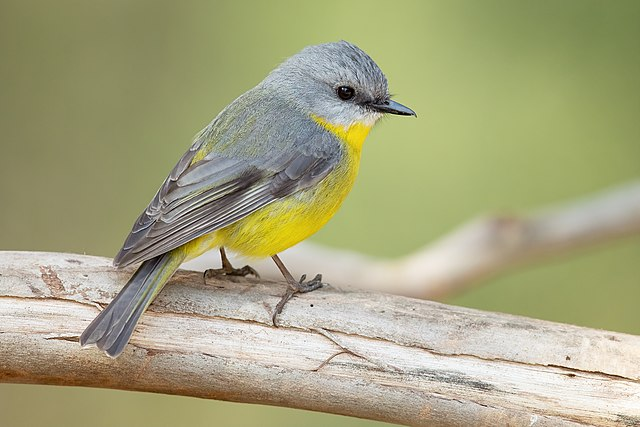

# 

### README

This script uses the Google Vision API to analyze the content of an image and outputs the results as a JSON file.

### How to Use:
1. Replace `your_api_key_here` with your Google Vision API key.
2. Set `image_path` to the path of your image file.
3. Run the script.
4. Results will be saved as `image_analysis_results.json`.

### Requirements:
- A Google Vision API key
- Python library: `requests` (install via `pip install requests`)